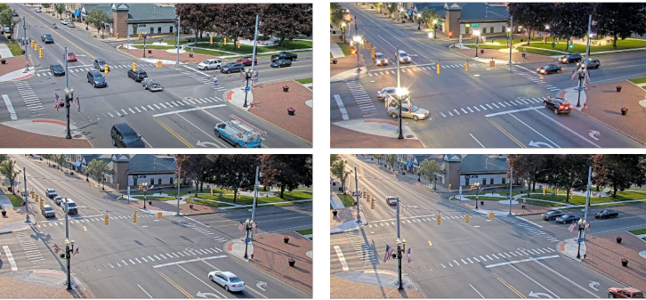
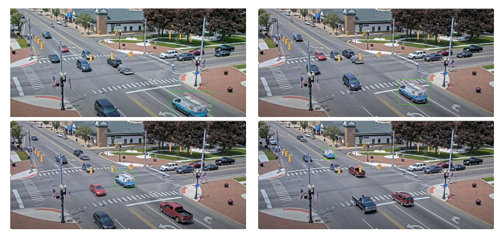

# Visual Traffic Monitoring Computer Vision Challenge
The goal of this project is to develop an automatic system for video analysis that enables
visual traffic monitoring at a road intersection (Figure 1). The system gets as input data
the video stream from a static camera and should be able to: (i) classify road lanes as being
occupied or not given a video frame; (ii) track a specific vehicle in a given video; (iii) count
the trajectories of vehicles in the intersection in a given video.

## Introduction
In this project you have to analyze video data obtained from a static camera with the desired goal of monitoring the traffic in an intersection. The videos are collected at different times during day/week so it is easy to observe that there are some changes in illumination in the scene specific to each video.

For each of the three tasks that you have to tackle in this project you are given a “context” video that is taken with a few minutes before the test data (images or video) that you have to analyze was acquired using the same
static camera.

For more details on the each of the 3 tasks, feel free to inspect `ProjectDetails.pdf`.

## Setup & How to run

I used Python 3.9 for this project. All requirements can be found in `requirements.txt`.

Note: The notebook uses an outdated method for obtaining YOLOv7 by manually downloading `yolov7.weights` and `yolov7.cfg`. We can now leverage much better YOLO versions through simple API calls from a framework such as `ultralytics`. 

My model can be found here: https://huggingface.co/thesergiu/yolov7. Simply download all the files and place them in the root directory of this repo.

The dataset Visual Traffic Monitoring can be found here: https://huggingface.co/datasets/thesergiu/Visual-Traffic-Monitoring/tree/main. Simply download all the files and place them in the root directory of this repo.

Notebook: VisualMonitoringNotebook.ipynb
The notebook has to be placed in the root of the project directory.

Cell: After the imports, there is a cell with a variable called 'mode'. It should be set to 'train' or 'test', depending on the location of the data you wish to execute.

Output: the output directory is "results/", and there is a directory associated with each of the 3 tasks. In it, are the predictions in the specified file format.

